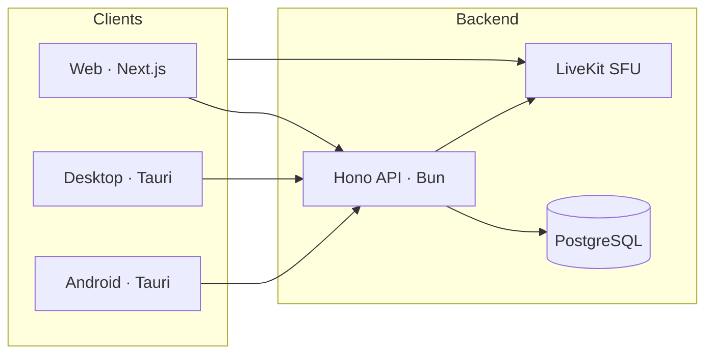

<p align="center">
  
</p>

<h1 align="center">Chatovo</h1>

<p align="center">
  <strong>Real-time voice rooms for web, desktop & Android.</strong><br/>
  One Next.js client · Tauri native shells · LiveKit media · Self-hostable
</p>

<p align="center">
  <a href="https://chatovo.ru"></a>
  <a href="https://www.gnu.org/licenses/gpl-3.0"></a>
  
  
</p>

<p align="center">
  <a href="https://chatovo.ru">Open Chatovo</a>
  &nbsp;·&nbsp;
  <a href="../../issues">Report a bug</a>
  &nbsp;·&nbsp;
  <a href="../../issues">Request a feature</a>
</p>

<br/>

## What is Chatovo?

Chatovo is a **Discord-inspired voice messenger** built around rooms — not endless channel lists. Spin up a room, share the link, start talking. Public, private, or password-protected.

<table>
<tr>
<td width="33%" valign="top">

**Rooms first**

Each room is its own space. No noisy server hierarchies — just the people you invited.

</td>
<td width="33%" valign="top">

**One UI everywhere**

The same experience in the browser, on Windows/macOS/Linux, and on Android.

</td>
<td width="33%" valign="top">

**Yours to host**

Docker Compose, Caddy, LiveKit SFU, PostgreSQL — run it on your own VPS.

</td>
</tr>
</table>

<br/>

## Features

<table>
<tr>
<td>

**Voice & video** — low-latency WebRTC via LiveKit SFU

**Room chat** — messages, markdown, file attachments

**Private rooms** — optional password on join

**Auth** — email + password ([better-auth](https://www.better-auth.com/))

</td>
<td>

**Desktop app** — tray, global shortcuts, PTT, screen share, auto-update

**Android** — Tauri 2 APK (manual install)

**i18n** — English & Russian (`next-intl`)

**Open API** — Hono + OpenAPI / Swagger UI

</td>
</tr>
</table>

<br/>

## Platforms

<p align="center">
  
  
  
  
  
</p>

<br/>

## Architecture



Frontend follows **[Feature-Sliced Design](docs/fsd.md)** — the `pages/` layer is named `views/` to avoid clashing with the Next.js router.

<br/>

## Tech stack

| Layer | Stack |
|:--|:--|
| **Client** | React 19 · Tailwind CSS 4 · Radix UI · TanStack Query · React Hook Form · Zod |
| **Native** | Tauri 2 · Rust · deep-link · updater · global-shortcut |
| **Server** | Hono · Prisma · better-auth · React Email |
| **Shared** | `@chatovo/schemas` — Zod types for client & server |
| **Tooling** | Biome · TypeScript · React Compiler · Bun workspaces |

<br/>

## Project structure

```
chatovo/
├── apps/
│   ├── client/       Next.js · FSD (app / views / widgets / features / entities / shared)
│   ├── server/       Hono API · Prisma · modules/
│   └── tauri/        Rust shell · desktop + Android
├── packages/schemas/ Shared Zod schemas
├── infra/            Caddy · LiveKit configs
├── docs/             Architecture & style guides
├── docker-compose.yml
└── docker-compose.dev.yml
```

<br/>

## Quick start

### 1 · Prerequisites

| Tool | Required for |
|:--|:--|
| [Bun](https://bun.sh) ≥ 1.1 | Everything |
| Docker + Compose | Local LiveKit / Postgres |
| Rust + SDKs | Tauri builds only → [docs](https://v2.tauri.app/start/prerequisites/) |

### 2 · Clone & install

```bash
git clone https://github.com/zilero232/chatovo.git
cd chatovo
bun install
```

### 3 · Environment

```bash
cp apps/server/.env.example apps/server/.env
cp apps/client/.env.example apps/client/.env
```

| Variable | Purpose |
|:--|:--|
| `BETTER_AUTH_SECRET` | Auth signing |
| `DATABASE_URL` / `DIRECT_URL` | Postgres (**`DIRECT_URL` is required** for Prisma) |
| `LIVEKIT_*` | SFU credentials (server) |
| `NEXT_PUBLIC_API_URL` | Client → API |
| `NEXT_PUBLIC_LIVEKIT_URL` | Client → media |
| `CORS_ORIGINS` | Allowed web origins |

### 4 · Database

```bash
bun --filter @chatovo/server db:push
```

### 5 · Run

**All-in-one (recommended)**

```bash
bun dev:full
```

Opens LiveKit + Caddy in Docker, then client (`:3000`) and server (`:4000`).  
Browse **`https://chatovo.localhost`** — accept the local certificate once.

**Split terminals**

```bash
bun dev:livekit    # terminal 1
bun dev            # terminal 2
```

### Native apps

```bash
bun tauri:dev                 # desktop dev
bun tauri:build               # desktop release
bun tauri:android:init        # first-time Android setup
bun tauri:android:dev         # Android on device / emulator
bun tauri:android:build       # AAB / APK
bun tauri:icon                # icons from apps/client/app/icon.svg
```

> Version is defined in root **`package.json`**. CI syncs it into Tauri before each release.

### Quality checks

```bash
bun typecheck
bun lint:fix
bun build
```

<br/>

## Deployment

| Target | Trigger |
|:--|:--|
| **Web + API** | Push to `master` → CI deploys Docker images (GHCR) |
| **Desktop + APK** | Bump root `package.json` version → GitHub Release |

On the VPS:

```bash
docker compose pull && docker compose up -d
```

<br/>

## Roadmap

| | Item |
|:--:|:--|
| ✅ | Voice & video rooms |
| ✅ | In-room text chat |
| ✅ | Web · desktop · Android |
| ✅ | Tray · shortcuts · PTT · screen share · auto-update |
| ⬜ | iOS client |
| ⬜ | Play Store listing |

<br/>

## Contributing

Bug reports and PRs are welcome. For larger changes, open an issue first.

```bash
bun lint:fix   # before you commit
```

<br/>

## License

**GNU General Public License v3.0** — free to use, study, share, and modify. Derivative works must stay open source under the same license. See [LICENSE](LICENSE).

<br/>

<p align="center">
  <sub>Built by <a href="mailto:zilero@chatovo.ru"><strong>Alexandr Artemev</strong></a></sub>
</p>

<p align="center">
  
</p>
